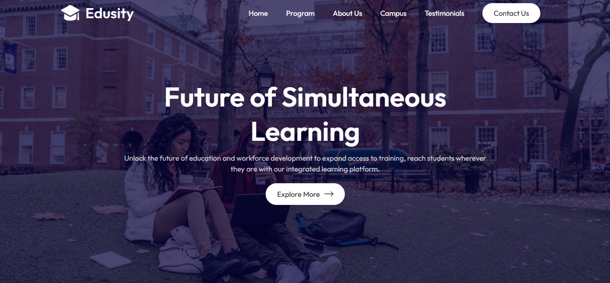

# Edusity Web Application



Welcome to the **Edusity Web Application**! This is a React-based web app designed for showcasing the offerings of an educational platform. It includes various sections such as programs, campus photos, testimonials, and contact information. The app features a video player that can be controlled based on user interaction.

## Features

- **Navbar:** Provides navigation links to different sections of the website.
- **Hero Section:** The main introductory area that gives an overview of the website.
- **Programs Section:** Lists various educational programs offered by Edusity.
- **About Section:** Displays information about the platform and includes a video player that can be toggled for playback.
- **Campus Section:** Shows images and photos of the campus.
- **Testimonials Section:** Displays reviews and feedback from satisfied clients.
- **Contact Section:** Provides a way for users to get in touch with the platform.
- **Footer:** Contains footer information and links.
- **Video Player:** A functional video player component that can play or pause based on user interaction.

### Installation

1. Clone the repository to your local machine:
   ```bash
   git clone https://github.com/abhisekumarjha/edusity.git
   ```
2. Navigate to the project directory:
   ```bash
   cd edusity
   ```
3. Install dependencies:
   ```bash
   npm install
   ```

### Running the Project

1. After the dependencies are installed, start the development server:
   ```bash
   npm start
   ```
2. Open your browser and navigate to `http://localhost:5173` to view the app.

## Technologies Used

- **React** for building the user interface.
- **React Hooks** (useState) for managing component state.
- **CSS** for styling the app.

## Live Demo

You can also view the live demo of the project hosted on [Vercel](https://edusity-jha.vercel.app/).
